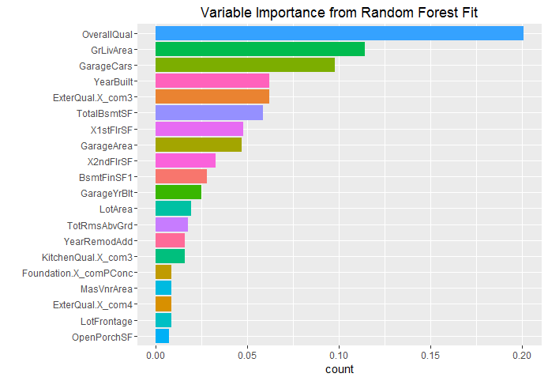

[](http://quantlet.de/)

## [](http://quantlet.de/) **SPL_HousePriceML_rfFeatureSelection** [](http://quantlet.de/)

```yaml

Name of Quantlet: SPL_HousePriceML_rfFeatureSelection
Published in:  'Statistic Programming Language - Student Project on ''Predicting House Prices using Machine Learning Techniques'' '
Description: 'Select variables to forcast the house price using random forest method, with the parameter taken from the tuning result.'
Keywords: random-forest, variable selection, plot, forecast, bar chart, error
Author: Dennis Koehn
Submitted: Sun, January 8, 2016 by Mingyang Li
Datafile: basic_processing.RData


```



### R Code
```r

##################################### Random Forest Variable Importance ##########################################

### setwd('F:/PHD/IRTG/courses/SPL/Quantlet/random_forest_feature_selection')
rm(list = ls())
graphics.off()

######### if package 'h2o' is not installed before, run the following code ############
######### source('install_h2o.R')

libraries = c("ggplot2")
lapply(libraries, function(x) if (!(x %in% installed.packages())) {
    install.packages(x)
})
lapply(c(libraries, "h2o"), library, quietly = TRUE, character.only = TRUE)

### load processed data
load("basic_processing.RData")
train = basic_data$train

### invoking the java virtual machine
localH2O = h2o.init(nthreads = -1)
h2o.clusterInfo(localH2O)
# convert training set into a h2o object
train_h2o = as.h2o(train)
# sepecify columns of inputs and labels
col_label = which(colnames(train) == "y")
col_input = which(colnames(train) != "y")

### fit the Random Forest
rfFit = h2o.randomForest(training_frame = train_h2o, x = col_input, y = col_label, model_id = "rf_covType_v1", 
    ntrees = 500, mtries = 20, sample_rate = 0.8, max_depth = 25)

### output results using figures
h2o.varimp_plot(rfFit)
h2o.shutdown()

### customized variable importance plot using ggplot2
ranked_variables = rfFit@model$variable_importances$variable
importance_per = rfFit@model$variable_importances$percentage
var_imp = data.frame(ranked_variables, importance_per)[1:20, ]
p = ggplot(var_imp, aes(x = reorder(ranked_variables, importance_per), weight = importance_per, 
    fill = ranked_variables))
p = p + geom_bar(aes(weights = importance_per)) + ggtitle("Variable Importance from Random Forest Fit") + 
    theme(legend.position = "none") + coord_flip() + xlab("")
print(p)
```

automatically created on 2018-05-28