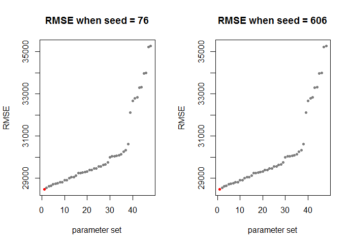

[](http://quantlet.de/)

## [](http://quantlet.de/) **SPL_HousePriceML_rfTuning** [](http://quantlet.de/)

```yaml

Name of Quantlet: SPL_HousePriceML_rfTuning
Published in:  'Statistic Programming Language - Student Project on ''Predicting House Prices using Machine Learning Techniques'' '
Description: 'Tune parameters for the random forest model using corss validation. The optimal parameter will be used to foreast house price.'
Keywords: random-forest, cross-validation, cv, plot, error, model, parameter
Author: Dennis Koehn
Submitted: Sun, January 8, 2016 by Mingyang Li
Datafile: basic_processing.RData


```

