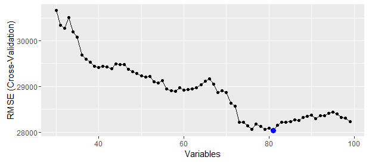

[](http://quantlet.de/)

## [](http://quantlet.de/) **SPL_HousePriceML_svmRFE** [](http://quantlet.de/)

```yaml

Name of Quantlet: SPL_HousePriceML_svmRFE
Published in:  'Statistic Programming Language - Student Project on ''Predicting House Prices using Machine Learning Techniques'' '
Description: 'Select variables to forcast the house price using support vector machine method, with the parameter taken from the tuning result.'
Keywords: SVM, support vector machine, variable selection, plot, forecast, error
Author: Dennis Koehn
Submitted: Sun, January 8, 2016 by Mingyang Li
Datafile: basic_processing.RData


```



### R Code
```r

########################### SMV feature selection #########################
rm(list = ls())
graphics.off()

libraries = c("caret", "ggplot2")
lapply(libraries, function(x) if (!(x %in% installed.packages())) {
    install.packages(x)
})
lapply(libraries, library, quietly = TRUE, character.only = TRUE)

load("basic_processing.RData")

train = basic_data$train
y = train$y
train$y = NULL

k = 5  # folds on the cv loop

subsets = 30:99 # subset to be evaluated

# specify model parameters
svmGaussianGrid = expand.grid(C = 4.5, sigma = 0.002)
# specify rfe options
ctrl = rfeControl(functions = caretFuncs, method = "cv", number = k, verbose = TRUE)
# perform actual varaible selection
rfe_gaussianSVM = rfe(x = train, y = y, sizes = subsets, rfeControl = ctrl, method = "svmRadial", 
    metric = "RMSE", tuneGrid = svmGaussianGrid)
# get varaible ranking and plot it
feature_ranking = predictors(rfe_gaussianSVM)
ggplot(rfe_gaussianSVM, type = c("g", "o"))

```

automatically created on 2018-05-28