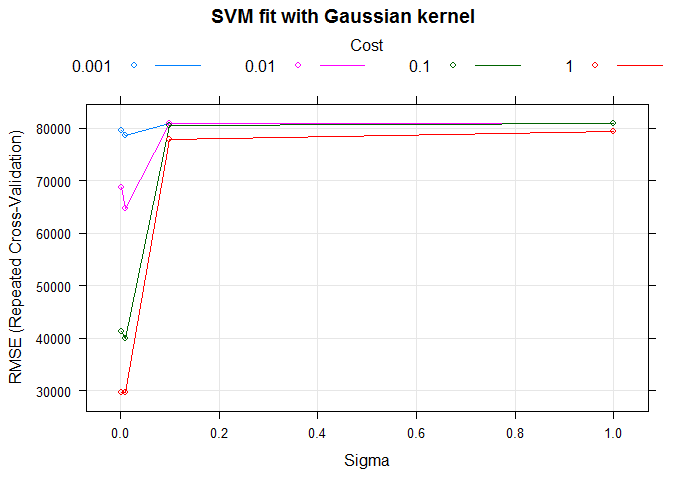
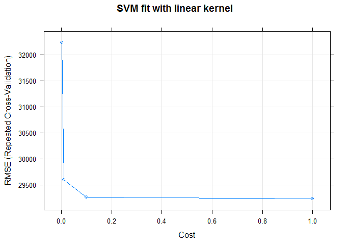

[](http://quantlet.de/)

## [](http://quantlet.de/) **SPL_HousePriceML_svmTuning** [](http://quantlet.de/)

```yaml

Name of Quantlet: SPL_HousePriceML_svmTuning
Published in:  'Statistic Programming Language - Student Project on ''Predicting House Prices using Machine Learning Techniques'' '
Description: 'Tune parameters for the support vector machine using corss validation. The optimal parameter will be used to foreast house price.'
Keywords: SVM, support vector machine, cross-validation, cv, plot, error, model, parameter
Author: Dennis Koehn
Submitted: Sun, January 8, 2016 by Mingyang Li
Datafile: basic_processing.RData


```





### R Code
```r

################################# SVM-Regression tuning #####################

### setwd('F:/PHD/IRTG/courses/SPL/Quantlet/svm_tuning')
rm(list = ls())
graphics.off()

libraries = c("caret")
lapply(libraries, function(x) if (!(x %in% installed.packages())) {
    install.packages(x)
})
lapply(libraries, library, quietly = TRUE, character.only = TRUE)

load("basic_processing.RData")

# get preprocessed data
train = basic_data$train
y = train$y
train$y = NULL

# set cv parameter
t = 10  # repetition on inner loop (here caret does it)
k = 5   # folds on the inner cv loop

# create Grid for GridSearch to tune hyperparameter
svmLinearGrid = expand.grid(C = c(0.001, 0.01, 0.1, 1))
svmGaussianGrid = expand.grid(C = c(0.001, 0.01, 0.1, 1), sigma = c(0.001, 0.01, 0.1, 1))

# determine evaluation method of the inner cv loop
ctrl = trainControl(method = "repeatedcv", number = t, repeats = k, verboseIter = TRUE)

# SVM with linear kernel
svmLinearFit = train(x = train, y = y, method = "svmLinear", trControl = ctrl, tuneGrid = svmLinearGrid, 
    metric = "RMSE", maximize = FALSE)
plot(svmLinearFit, main = "SVM fit with linear kernel")

# SVM with Gaussian Kernel
svmGaussianFit = train(x = train, y = y, method = "svmRadial", trControl = ctrl, tuneGrid = svmGaussianGrid, 
    metric = "RMSE", maximize = FALSE)
plot(svmGaussianFit, main = "SVM fit with Gaussian kernel")

```

automatically created on 2018-05-28