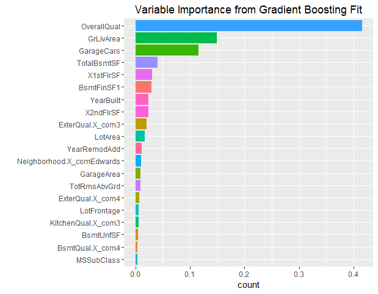

[](http://quantlet.de/)

## [](http://quantlet.de/) **SPL_HousePriceML_xgbFeatureSelection** [](http://quantlet.de/)

```yaml

Name of Quantlet: SPL_HousePriceML_xgbFeatureSelection
Published in:  'Statistic Programming Language - Student Project on ''Predicting House Prices using Machine Learning Techniques'' '
Description: 'Select variables to forcast the house price using xgboosting algorithm, with the parameter taken from the tuning result.'
Keywords: xgboosting, variable selection, plot, forecast, error, bar chart
Author: Dennis Koehn
Submitted: Sun, January 8, 2016 by Mingyang Li
Datafile: basic_processing.RData


```




### R Code
```r

########################### Variable Importance and Feature Selection using xgboost #############################

### setwd('F:/PHD/IRTG/courses/SPL/Quantlet/xgboosting_feature_selection')
rm(list = ls())
graphics.off()

libraries = c("caret", "xgboost", "Matrix", "ggplot2", "Ckmeans.1d.dp")
lapply(libraries, function(x) if (!(x %in% installed.packages())) {
    install.packages(x)
})
lapply(libraries, library, quietly = TRUE, character.only = TRUE)

# get preprocessed data
load("basic_processing.RData")
train = basic_data$train
y = train$y
train$y = NULL

# convert for data into a format xgb.train can handle
dtrain = xgb.DMatrix(data = sapply(train, as.numeric), label = y)

# determine arbitrary xgboost parameters in a list
xgb_paramters = list(eta = 0.025, max.depth = 16, gamma = 0, colsample_bytree = 0.8, subsample = 0.6, 
    eval_metric = "rmse", maximize = FALSE)
# fit the xgboost
xgbFit = xgb.train(params = xgb_paramters, data = dtrain, booster = "gbtree", nround = 500, verbose = 1, 
    objective = "reg:linear")
importance_matrix = xgb.importance(colnames(train), model = xgbFit)

### customized variable importance plot
ranked_variables = importance_matrix$Feature
importance_per = importance_matrix$Gain
var_imp = data.frame(ranked_variables, importance_per)[1:20, ]
p = ggplot(var_imp, aes(x = reorder(ranked_variables, importance_per), weight = importance_per, 
    fill = ranked_variables))
p = p + geom_bar(aes(weights = importance_per)) + ggtitle("Variable Importance from Gradient Boosting Fit") + 
    theme(legend.position = "none") + coord_flip() + xlab("")
print(p)

# plot variable importance
retained_variables = 1:nrow(importance_matrix)
variance_level = cumsum(importance_matrix$Gain)
retained = data.frame(variance_level, retained_variables)
p = ggplot(data = retained, mapping = aes(retained_variables, variance_level))
p = p + geom_line() + geom_point()
p = p + ggtitle("Retained Variables vs. Cumsum VI") + xlab("# Variables") + ylab("Cumsum of VI")
print(p)

```

automatically created on 2018-05-28